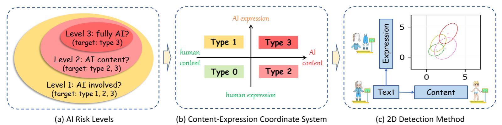

# Truth Mirror (2D Detection)
**This code is for our paper "Decoupling Content and Expression: Two-Dimensional Detection of AI-Generated Text"**.

[Paper](https://arxiv.org/abs/xxx.xxx)
| [Demo](http://region-9.autodl.pro:21504/xxx)

We are working on the demo and will update the link soon.

## Brief Intro
<div align=center>

</div>
We detect three levels of AI risk by decoupling a text into content and expression dimensions. The detector performs a binary classification within the two-dimensional space for each detection task.
Our findings show that content is resistant to surface-level changes, which can serve as a key feature for detection.

## Environment
* Python3.12
* Setup the environment:
  ```pip install -r requirements.txt```

## Experiments
Following folders are created for our experiments:
* ./exp_main -> experiments on English datasets from HART (main.sh).
* ./exp_langs -> experiments on CC News across five languages (langs.sh).
* ./exp_raid -> experiments on RAID (raid.sh).

(Notes: we share the data and results for convenient reproduction.)

### Citation
If you find this work useful, you can cite it with the following BibTex entry:

    @articles{bao2025decoupling,
      title={Decoupling Content and Expression: Two-Dimensional Detection of AI-Generated Text},
      author={Bao, Guangsheng and Rong, Lihua and Zhao, Yanbin and Zhou, Qiji and Zhang, Yue},
      booktitle={arxiv: xxx.xxx},
      year={2025}
    }


